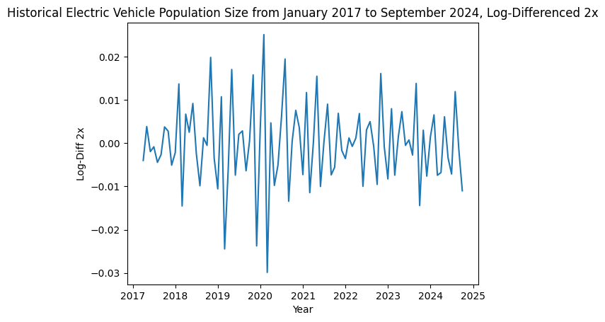
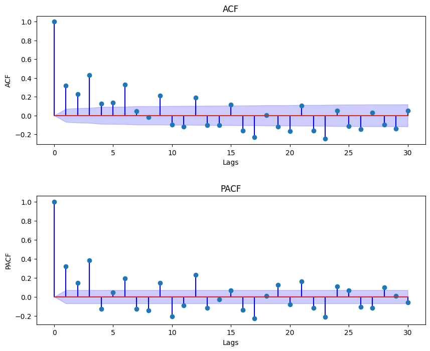
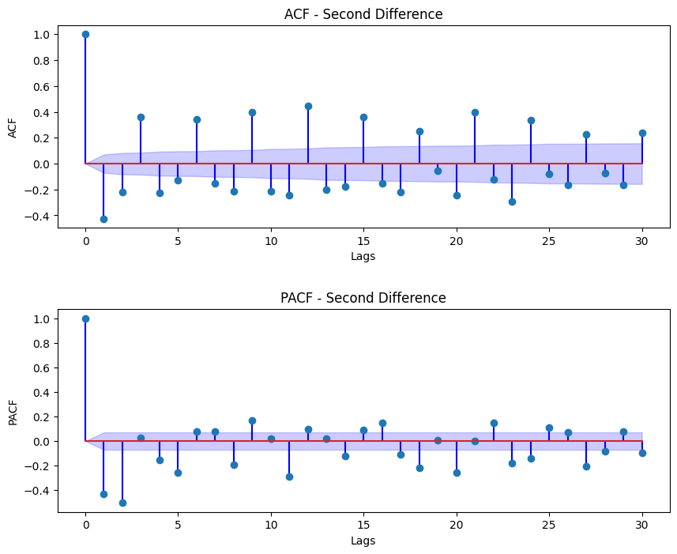
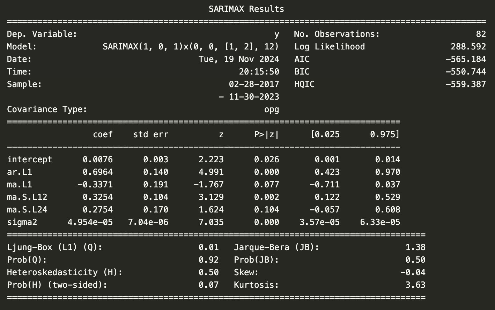

# Timeseries analysis using ARIMA/ETS/STL model vs LSTM 

The dataset used is provided by the official Washington state open data portal, orginating from the research and analysis office in the Department of Licensing. This data includes historical electrical vehicle population counts form January 2017 through September 2024. There is a total of 7 years of data and 92 data points.

Variables: Date, Plug-In Hybrid Electric Vehicle (PHEV) count, Battery Electric Vehicle (BEV) Count, Electric Vehicle (EV) Total

Here is our plotted data. We can see that it looks non-linear and non stationary. 

Time series models such as ARIMA and SARIMA require data to be stationary. We first take the log of the data to stabilize the variance and linearize the exponential growth. Then we take the difference of the data to remove trends and seasonality to try to acheive stationarity.

We run an augmented Dickey-Fuller test to check for stationarity.
Results:

ADF Statistic -2.816328149227266

p-value 0.05597899517932277

Critical Values {'1%': -3.506057133647011, '5%': -2.8946066061911946, '10%': -2.5844100201994697}

H0: The time series is non-stationary
HA: The times sereis is stationary
Our test statistic is greater than our critical value at 5% confidence level -2.816 > -2.894, the p-value is slightly creater than 0.05 at 0.056. We fail to reject he null hypothesis, however the time series is very close to stationary. At the 10% level it is considered stationary.

Since taking the log then differencing did not make the data conclusively stationary, we consider taking a second difference.

We run another augmented Dickey-Fuller test to check for stationarity.

ADF Statistic -3.686360058186925

p-value 0.004309154516231539

Critical Values {'1%': -3.5148692050781247, '5%': -2.8984085156250003, '10%': -2.58643890625}

After differencing a second time the series is now more conclusively stationary. We want to be careful of over differencing the data, which can lead to loss of meaningful information and increased noise. 

We compare the ACF and PACF plots.

One indication of over-differencing is seen in the ACF of the series with a second difference. There is a significant negative autocorrelation at lag 1. To verify we look at the standard deviation of both series.

Standard Deviation - First Difference: 0.008192783781508098

Standard Deviation - Second Difference: 0.009559528347039685

The standard deviation of the 2nd differenced series is slightly larger than the first differenced series. Which also suggests over-differencing. 
We proceed using the first differenced series. 

Auto SARIMAX produced a model with a AR(1) term, MA(1) term, a SMA(2) term, and a seasonal periodicity of 12. 

Our Ljung-Box, Q-statistic, assesses whether the residuals are uncorrelated or white noise. Our Null hypothesis is that there is no autocorrelation in the residuals, our alternative is that there is autocorrelation. This model produces a small q-statistic and a p-value >0.05. We fail to reject the null hypothesis which suggests that the residuals show no significant autocorrelation. 

The Heterskedasticity test statistic checks whether the variance of the residuals is constant(homoskedastic) or if it changes over time(heteroskedastic). The low value, H=0.5, suggests that there isn't mych evidence for heteroskedasticity in the residuals, the variance remains fairly constant. However the p-value is 0.07 which is slightly above 0.05 suggesting that the residuals seem fairly constant but there may be evidence of heteroskedasticity. Heteroskedasticity in the residuals means that there may be biased in standard errors which affects the accuracy of the statistical significance of the coefficients.

The Jarque-Bera test checks wether the residuals follow a normal distribution, testing for skewness and kurtosis. Our null hypothesis is that the reisudal follow a normal distribution, alternative is that it does not. Given our high p-value of 0.5 > 0.05 we fail to reject the null, which suggests the reisduals appear to be normally distributed. The skew value suggests that it is very close to symmetric, and the kurtosis is slightly above 3 indicating the distribution is slightly leptokurtic, or having heavier tails. 

