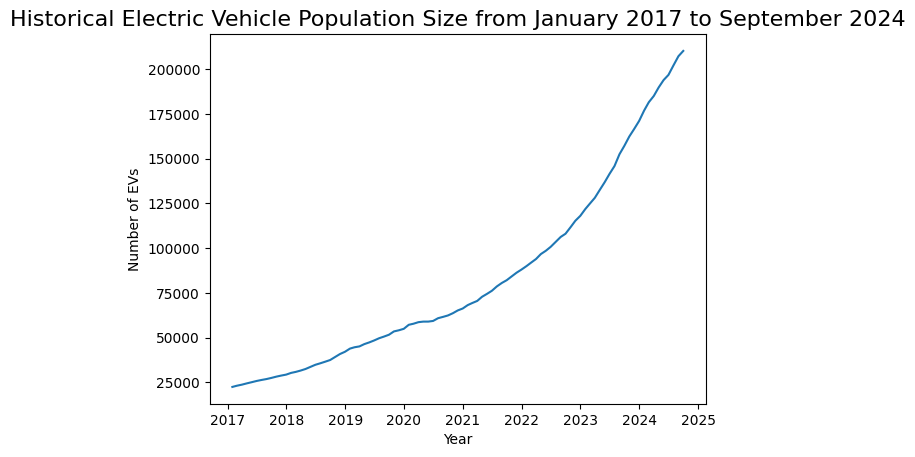
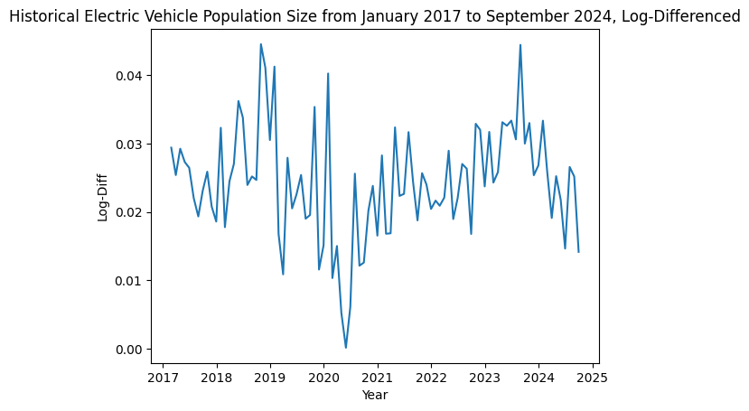

# Timeseries analysis using ARIMA model vs LSTM 

This project is evaluates the use of ARIMA model for time series analysis in comparison to LSTM machine learning technique. 

The dataset used is provided by the official Washington state open data portal, orginating from the research and analysis office in the Department of Licensing. This data includes historical electrical vehicle population counts form January 2017 through September 2024. There is a total of 7 years of data and 92 data points.

Variables: Date, Plug-In Hybrid Electric Vehicle (PHEV) count, Battery Electric Vehicle (BEV) Count, Electric Vehicle (EV) Total

Here is our plotted data. We can see that it looks non-linear and non stationary. 

Time series models such as ARIMA and SARIMA require data to be stationary. We first take the log of the data to stabilize the variance and linearize the exponential growth. Then we take the difference of the data to remove trends and seasonality to try to acheive stationarity.

