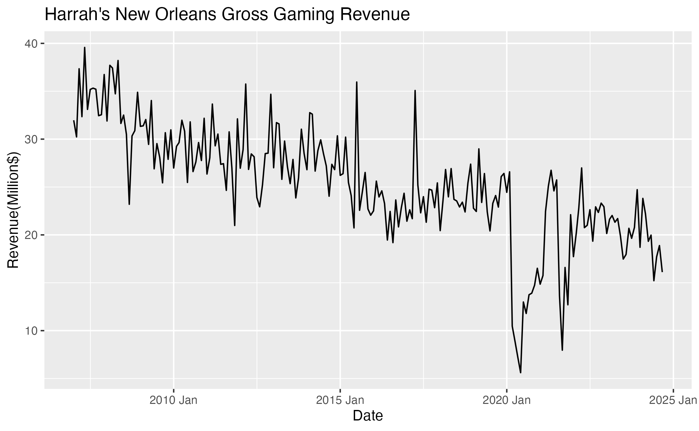
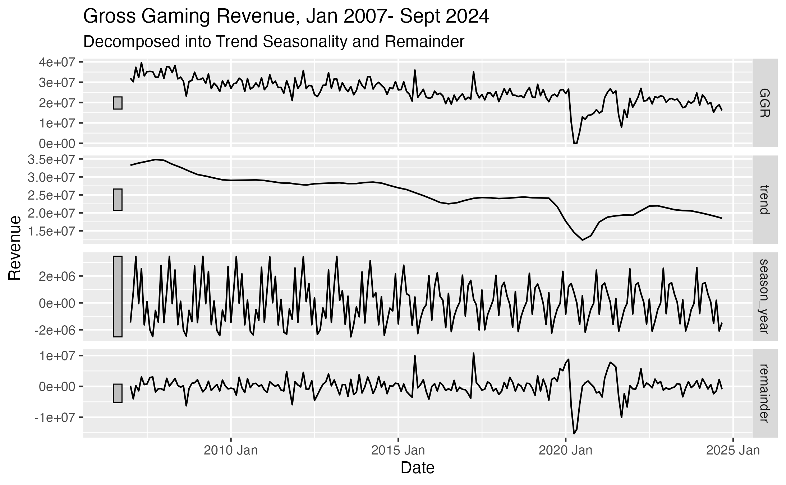
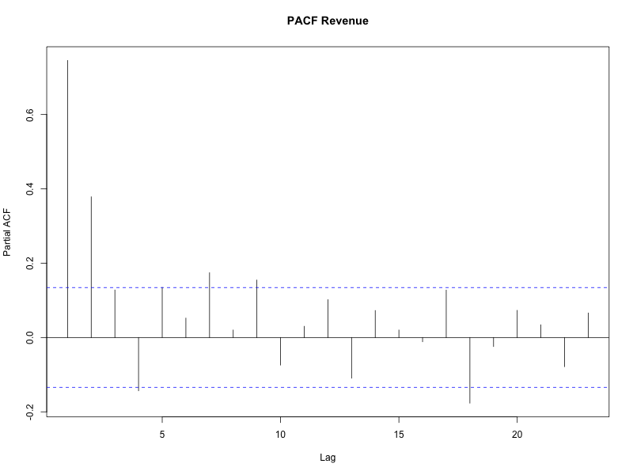

# Time Series Analysis of Louisiana's Gambling Revenue

## Table of Contents
- [Data](#data)
- [Data Preprocessing](#data-preprocessing)
- [Methodology](#methodology)
- [Exploratory Analysis](#exploratory-analysis)
- [Model Evaluation](#model-evaluation)

## Introduction
The objective of this project is to evaluate and compare forecasting methods to achieve the highest accuracy forecast of the monthly revenue of Harrah’s casino located in New Orleans, Louisiana. The models considered are ARIMA, ETS, GARCH, and Meta’s Prophet. I will evaluate the model performance in forecasting revenue 1-month to 6-months. This dataset posed an interesting problem as it contains two back-to-back outliers. One was a result of COVID lockdown in the spring of 2020 and the second was a result of Hurricane Ida the following year. Outlier detection and imputation was done to handle these shocks. The best performing model was the ARIMA model achieving a RMSE of 2,816,615 and a MAPE of 12.3%. 

## Data  
The dataset was created from the monthly revenue reports provided by the <a href="https://lgcb.dps.louisiana.gov/revenue_reports.htm" target="_blank">Louisiana Gaming Control Board</a>. The dataset is composed of the reported monthly gross gaming revenue from Harrah's casino spanning from January 2007 to September 2024, totaling 213 data points. 

Figure 1 is Harrah's month gross gaming revenue.

 Figure 1

## Data Preprocessing

Imputation was done for observed outliers that resulted from two significant drops in revenue. First was the result of COVID lockdowns in 2020. A stay-at-home order was implemented in March 23, 2020 as a result Harrah's monthly revenue in the March of 2020 was 64% less than March of the previous year. Harrah's reported zero revenue for the months of April and May after the lockdowns continued to be in effect. Harrah's reopened when the state transistion to phase 2 of reopening on June 5th, 2020[wikipedia]. In the month of June Harrah's reported a revenue that was 75% less than the same month in the previous year.

In dealing with COVID era data I considered a few options, the simplest being keeping the COVID era data, removing it, or imputation. I also considered creating a dummy varaible for pre-COVID data and post-COVID data, but the difficulty in that was defining when post-COVID begins. Also, from our data we can see that by the following March 2021, it had returned to pre-lockdown revenues until there was dramatic dip again starting August of 2021. This was likely due to hurricane Ida which caused widespread power outages, wind damage, localized flooding. Many residents decided to evacuate the area before the storm. 

I decided to imputate, the R package 'tsoutliers' automatically detects outliers and suggests values for replacement. The function determined revenues in April 2020 and May of 2020, both zero, to be the only outliers and suggested replacements. 

Figure 2 is the data after imputation. 

 Figure 1

## Exploratory Analysis

From visual inspection we can see a general downward trend, and we can see the effects of the pandemic lockdowns begining March of 2020 and the gradual return of revenue as the state slowly reopened. We can also see the dip in revenues as a result of hurricane Ida in August the following year. 

Seasonality is not obvious from visual inspection. I inspected for seasonality in figure 2 using a seasonal plot. It shows the monthly gaming revenue across the months by year. There is a lot of variability each month between the year, with no indication of seasonality. 

   Figure 2

Seasonal trend decomposition with Loess, or STL, was then used on the imputed data to look for any underlying patterns. STL was chosen over other methods of decomposition such as X-11 for its flexibility. It is robust with missing values and outliers, and does not follow strict assumptions about periodicity. From Figure 4 we can evaluate whether the error, trend, and seasonality components are additive, multiplicative, or if no trend or seasonality is present. It is likely that the error is additive, despite some volatility it is fairly constant over time, it does not increase or decrease with the level. As opposed to multiplicative where the error scales to the level of the data. The trend is also likely additive but could also be additive and damped. There is a downward slope especially fowllowing a significant dip in revenue, however we could consider it damped as it does tend to flatten out over time. From visual inspection the seasonality could be additive or multiplicative, it is fairly constant, however there is increased variation as the levels decrease. 

   Figure 4

  

## Methodology

All models except prophet was done in R. The prophet model was built using python programming. 

In order to use the ARMA model the data needs to be stationary, where the mean and variance is constant across time and autocovariance, which is the difference between values at different time lags depends on the lag and not the specific time. An Augmented Dickey-Fuller test, ADF test, was conducted on the imputed and logged data to check for stationarity. The following is the result of our ADF test. 
  
  | Dickey-Fuller | Lag Order | P-Value | 
  |---------------|-----------|---------|
  | -4.7          | 5         | 0.01    |
  
Our test statistic tells us how far the data is from a unit root. A unit root is a stochastic trend in a time series that indicate that a value will be highly dependent on its past values, the presence of a unit root indicates that it is non-stationary. The negative number suggests that it further far a unit root.  Our alternative hypothesis is stationarity, our p-value is <0.05 so we can reject the null-hypothesis which is that it is non-stationary.

An ACF plot however shows a more gradual decline to zero which suggests non-stationarity. When the data is differenced an ADF test still the ACF no longer suggests non-stationarity, however the PACF still has several significant spikes. 

 Figure 5

 Figure 6

The autocorrelation function, acf, plot shows suggest that an autoregressive, AR, model may be appropriate. The partial autocorrelation function, PACF, plot suggests that it may be of order 1 or higher.

The ETS and Prophet models do not require stationarity, as it models trends, seasonality and other non-stationary underlying structures directly. So an ADF test is no necessary.

The first training set is composed of 90% of our data and the test set is the remaining 10%.  Cross validation was done by creating multiple training sets from the training set. The first training set will to forecast each subsequent data point, the next training set will add the next datapoint in the series creating a data set of 171 observations, the next 172, and so on. Forecast accuracy is computed by averaging over the test Figure 7 illustrates this where blue are the training sets and the orange are the test sets. One illustrates forecast 1 step ahead and the other 4 steps ahead. 

 Figure 7

This cross validation technique is used for the ARIMA, ETS, and the prophet model.

While ETS does not support exogenous variables ARIMA does and was considered for the ARIMA. The exogenous variable would be a dummy indicating whether the observation was during COVID lockdown period or evacuation period due to Hurricane Ida. The resulting models exhibiting unit roots and became problematic with the smaller datasets in our cross validation where the exogenous variable was all zeros because neither COVID or hurricane evacuations occured. The prophet model allows for inclusion of holdidays, special events, and shocks much more smoothly. Shocks were included in the prophet model for the lockdown period from March 2020 to June 2020, and the Hurricane Ida period which effected revenue from August of 2021 to November of 2021. The performance of the prophet model with the shocks improved on all metrics in comparison to the prophet model without.

For the prophet model two parameters were tuned. The first was changepoint_prior_scale which determines how much the trend changes at the trend changepoints, where too small of a value can be an underfit handling extreme changes in the trend and too large of a value will cause overfitting. The second was seasonality_prior_scale, this controls the flexibility of the seasonality, where larger alues allow the seasonality to include large fluctuations and smaller value shrinks that magnitude. Four values for each parameter was tested using RMSE as the metric for evaluation. Both parameters work like regularization techniques. The best value for changepoint_prior_scale is 0.001 and the seasonlity_prior_scale was 0.01.

## Model Evaluation

The following are the resulting performance metrics from the cross-validation training at different horizons, a mean model with a 6-month rolling window average was used as a benchmark model. Results are fairly similar across models. Using RMSE to evaluate our models we can see that for short term forecasts the ETS model performs the best. The Prophet model performs better for longer horizon.  

Horizon: 1-month 

| Model   | RMSE      | MAE       | MAPE   |
|---------|-----------|-----------|--------|
| Mean    | 5,301,099 | 3,701,840 | 26.87% |
| ARIMA   | 5,071,280 | 3,344,302 | 23.78% |
| ETS     | 4,588,385 | 2,996,947 | 21.64% |
| Prophet | 4,714,701 | 3,557,216 | 21.80% |

Horizon: 6-month

| Model   | RMSE      | MAE       | MAPE   |
|---------|-----------|-----------|--------|
| Mean    | 6,215,005 | 4,336,561 | 31.67% |
| ARIMA   | 6,677,959 | 4,455,446 | 31.75% |
| ETS     | 6,037,209 | 4,060,273 | 30.24% |
| Prophet | 6,018,903 | 5,282,748 | 32.90% |

Horizon: 12-month

| Model   | RMSE      | MAE       | MAPE   |
|---------|-----------|-----------|--------|
| Mean    | 6,577,880 | 4,609,366 | 33.14% |
| ARIMA   | 7,182,500 | 4,845,162 | 33.89% |
| ETS     | 6,522,722 | 4,536,396 | 32.82% |
| Prophet | 6,018,903 | 5,282,748 | 32.90% |

### Residual Analysis

In addition to the cross-validation results, I looked at innovation residuals to evaluate these forecasting methods. What we look for are residuals that are uncorrelated which tells us that the models have captured all the information from the data. The other important properties is to see if residuals center around zero which tells us whether the forecast is biased or not. Additionally, but not necessary, we can check to see if  

The fable package in R allows for easy plotting of our residuals, Figure 8 and 9 are the residual plot of our ETS and ARIMA model. These plots make it easy to visually inspect for a mean that centers around zero. 

 Figure 8 ETS Residual Diagnosis

 

 Figure 9 ARIMA Residual Diagnosis

For the prophet model, I manually plotted the residuals to inspect for a mean around zero. Figure 10 is the residual plot from the Prophet Model. Apart from the outliers as a result of shocks from COVID and Hurricane IDA it does stay fairly centered around zero for all models. 

 Figure 10 Prophet Residual Diagnosis

To check for autocorrelation in the residuals we use the Ljung-Box test. The null hypothesis is that there is no autocorrelation and the residuals are independently distributed. The alternative hypothesis is that at least one autocorrelation is statistically significant different from zero. 

| Model    | Ljung-Box Statistic    | P-Value |
|----------|------------------------|---------|
| Mean     | 18.91 | 0.0001|
| ARIMA*   | 0.07  | 0.78  |
| ETS      | 0.19  | 0.66  | 
| Prophet  | 19.80 | 0.031 | 

The following are the results from the model trained using 90% of the dataset and tested using the remaining 10% of the dataset. The test set has 22 observations from December 2022 to September 2024. Across all metrics the prophet model performes the best. 

| Model    | RMSE      | MAE       | MAPE   |
|----------|-----------|-----------|--------|
| Mean     | 2,947,411 | 2,349,928 | 12.78% |
| ARIMA*    | 2,816,615 | 2,274,886 | 12.30% |
| ETS      | 3,992,650 | 3,609,188 | 18.91% |
| Prophet | 2,119,691 | 1,723,205 | 5.52%  |

## Forecast Results 

Moving forward using the ARIMA model for a six-month forecast. Figure 11 is a plot of the 6-month forecast for Harrah's.

 Figure 11 6-Month Forecast

| Date | Revenue |
|------|---------|
| 2024 Oct | 18,028,886 |
| 2024 Nov | 18,830,544 |
| 2024 Dec | 18,164,272 |
| 2025 Jan | 19,670,769 |
| 2025 Feb | 18,902,990 |
| 2025 Mar | 19,621,175 |

