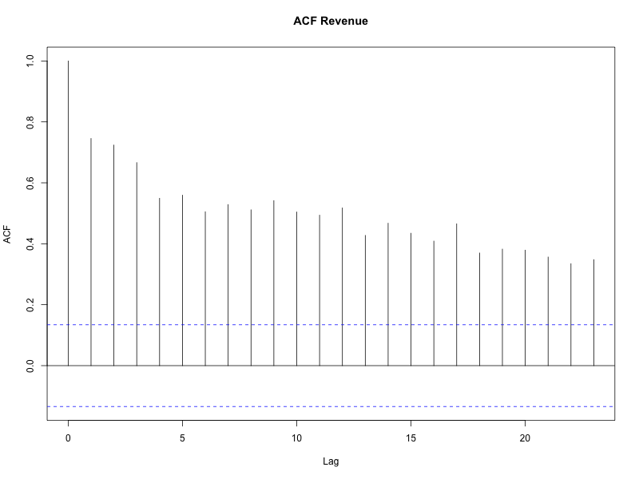

# Time Series Analysis of Louisiana's Gambling Revenue

## Table of Contents
- [Data](#data)
- [Methodology](#methodology)
- [Exploratory Analysis](#exploratory-analysis)
- [Model Evaluation](#model-evaluation)

## Introduction
The objective of this project is to evaluate and compare forecasting methods to achieve the highest accuracy forecast of the monthly revenue of Harrah’s casino located in New Orleans, Louisiana. The models considered are ARIMA, ETS, and Meta’s Prophet. We will evaluate the model performance in forecasting revenue one month, 6 months, and 1 year out. 

This dataset posed an interesting problem as it contains two back-to-back outliers. One was a result of COVID lockdown in the spring of 2020 and the second was a result of Hurricane Ida the following year. 

****Insert summary of results

## Data  
The dataset was created from the monthly revenue reports provided by the <a href="https://lgcb.dps.louisiana.gov/revenue_reports.htm" target="_blank">Louisiana Gaming Control Board</a>. The dataset is composed of the reported monthly gross gaming revenue from Harrah's casino spanning from January 2007 to September 2024, totaling 213 data points. 

Data Preprocessing

Imputation was done for observed outliers that resulted from two significant drops in revenue. First was the result of COVID lockdowns in 2020. A stay-at-home order was implemented in March 23, 2020 as a result Harrah's monthly revenue in the March of 2020 was __% less than March of the previous year. Harrah's reported zero revenue for the months of April and May after the lockdowns continued to be in effect. Harrah's reopened when the state transistion to phase 2 of reopening on June 5th, 2020[wikipedia]. In the month of June Harrah's reported a revenue that was 75% less than the same month in the previous year.

In dealing with COVID era data I considered a few options, the simplest being keeping the COVID era data or completely removing it. I also considered creating a dummy varaible for pre-COVID data and post-COVID data, but the difficulty in that was defining when post-COVID begins. Also, from our data we can see that by the following March 2021, it had returned to pre-lockdown revenues until there was dramatic dip again starting August of 2021. This was likely due to hurricane Ida which caused widespread power outages, wind damage, localized flooding. Many residents decided to evacuate the area before the storm. 

Rather than completely removing hurricane/covid era data points but in an effort to preserve the information provided by these significant events, linear interpolation was utilized to impute for the months of March, April, May, and June of 2020 and September of 2021. The result was a reduction in the magnitude of these outliers. After our exploratory analysis, the imputed data was tranformed using natural log to stabilize the variance prior to training the models. 

Models were run with using the imputed and log transformed data and the non-imputated and log transformed data to compare results. The models trained with the imputed data produced significantly better results across all metrics. 

## Exploratory Analysis

Figure 1 is Harrah's month gross gaming revenue. From visual inspection we can see a general downward trend, and we can see the effects of the pandemic lockdowns begining March of 2020 and the gradual return of revenue as the state slowly reopened. We can also see the dip in revenues as a result of hurricane Ida in August the following year. 

 Figure 1

Seasonality is not obvious from visual inspection. I inspected for seasonality in figure 2 using a seasonal plot. It shows the monthly gaming revenue across the months by year. From visual inspection there is a lot of variability each month between the year, with no indication of seasonality. 

   Figure 2

Figure 3 shows the data after the largest outliers, revenue from April, May, and June of 2020 and September of 2021, was replaced using linear interpolation as described in the data section. 

   Figure 3

Seasonal trend decomposition with Loess, or STL, was then used on the imputed data to look for any underlying patterns. STL was chosen over other methods of decomposition such as X-11 for its flexibility. It is robust with missing values and outliers, and does not follow strict assumptions about periodicity. From Figure 4 we can evaluate whether the error, trend, and seasonality components are additive, multiplicative, or if no trend or seasonality is present. From visual inspection it is likely that the error is additive, despite some volatility it is fairly constant over time, it does not increase or decrease with the level. As opposed to multiplicative where the error scales to the level of the data. The trend is also likely additive but could also be additive and damped. There is a downward slope especially fowllowing a significant dip in revenue, however we could consider it damped as it does tend to flatten out over time. From visual inspection the seasonality could be additive or multiplicative, it is fairly constant, however there is increased variation as the levels decrease. 

   Figure 4

  

## Methodology
ARIMA
In order to use the ARMA model the data needs to be stationary with a constant mean across time and constant variance. A Dickey-Fuller test was conducted on the imputed and logged data to check for stationarity. The following is the result of our ADF test. 
  
  | Dickey-Fuller | Lag Order | P-Value | 
  |---------------|-----------|---------|
  | -4.7          | 5         | 0.01    |
  
Our test statistic tells us how far the data is from a unit root. A unit root is a stochastic trend in a time series that indicate that a value will be highly dependent on its past values, the presence of a unit root indicates that it is non-stationary. The negative number suggests that it further from a unit root and that our series is stationary.  Our alternative hypothesis is stationarity, our p-value is <0.05 so we can reject the null-hypothesis. 

An ACF plot however shows a more gradual decline to zero which suggests non-stationarity. When the data is differenced an ADF test still the ACF no longer suggests non-stationarity, however the PACF still has several significant spikes. 

 Figure 5

 Figure 6

These results suggest that while the data is technically stationary there are some persistent or long-memory process where shocks or trends persist for extended periods.

The ETS and Prophet models do not require stationarity, as it models trends, seasonality and other non-stationary underlying structures directly. 

To cross validate multiple training sets are created. The first training set is composed of 80% of our data or 170 observations to forecast each subsequent data point, the next training set will add the next datapoint in the series creating a data set of 171 observations, the next 172, and so on. Forecast accuracy is computed by averaging over the test Figure 7 illustrates this where blue are the training sets and the orange are the test sets. One illustrates forecast 1 step ahead and the other 4 steps ahead. 

 Figure 7

A similar cross validation technique is used for the ARIMA, ETS, and prophet model.

## Model Evaluation

ARIMA 
Using the fable package in R, the optimal ARIMA model was identified as ARIMA(0,1,1)(0,0,1)[12], indicating that the data required first differencing to achieve stationarity, included a non-seasonal moving average term (MA1), a seasonal moving average term (SMA1), and exhibited a 12-month seasonal period.

|      |   MA1   |   SMA1 |
|------|---------|--------|
| Coefficients | -0.4919 | 0.1081 |
| S.E. | 0.0729  | 0.0748 |

| $\sigma^2$ | log-likelihood |  AIC  |  BIC  |
|------------|----------------|-------|-------|
| 0.0234 | 87.91 | 169.82 | 160.08 |

## Forecast Results 

